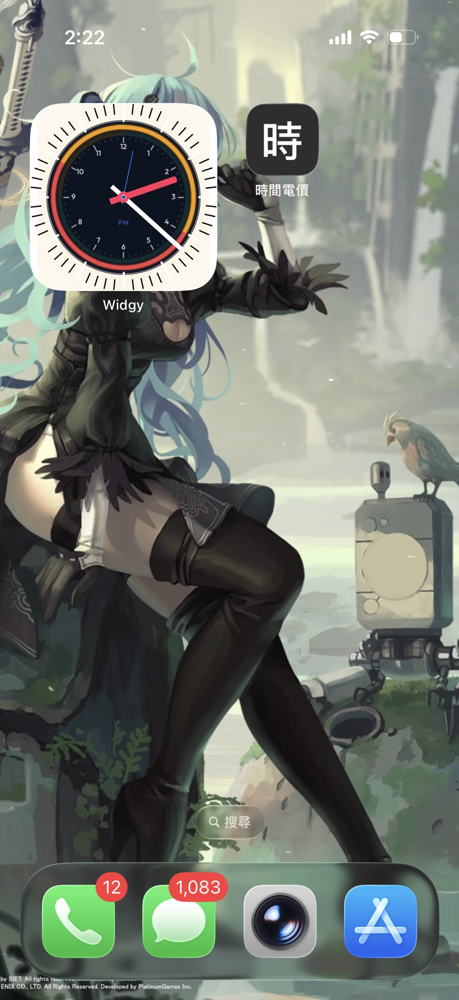
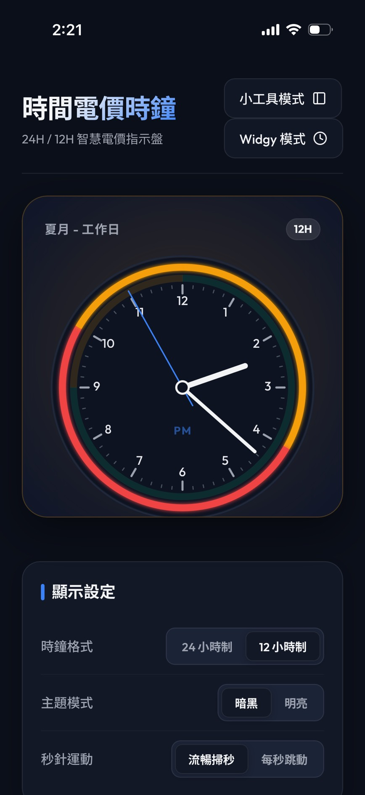
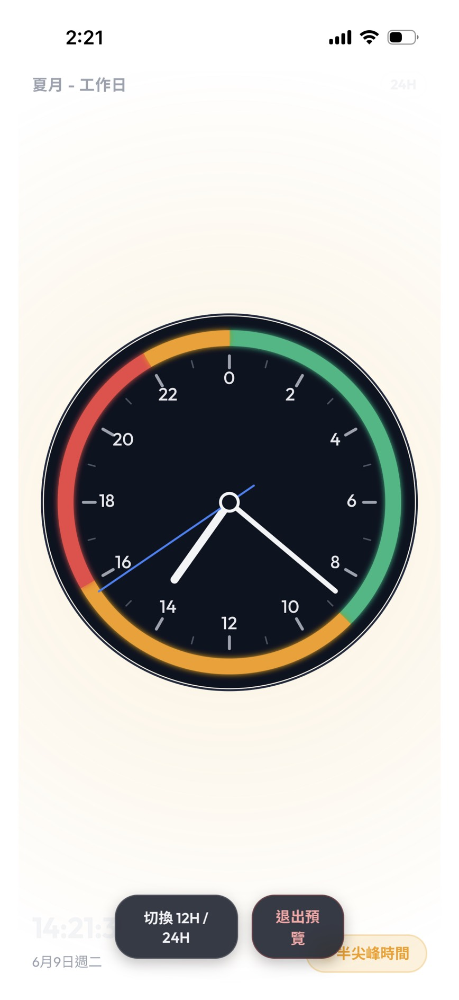
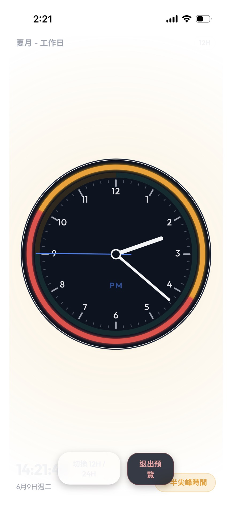

# 台灣時間電價時鐘 for iPhone Widgy

一個專為 iPhone 設計的 **時間電價類比時鐘網頁**。  
本專案將複雜的時間電價排程（尖峰、半尖峰、離峰）以彩色環形段呈現在類比時鐘的刻度盤上，  
並支援 24 小時與 12 小時顯示，讓您一眼掌握目前的電價時段。  
亦提供不顯示指針的模式，供 Widgy 疊加 iOS 原生指針。  

<p align="center">
  
  
  
    
</p>

---

## 📁 Repository 內容與架構

本專案包含以下檔案，您可以直接上傳至 GitHub，並建議開啟 **GitHub Pages** 功能作為小工具的連線網址：

- **[index.html](index.html)**：網頁主結構。包含 SVG 向量時鐘結構、模擬測試面板、自訂顏色選取器與 JSON 排程編輯器。
- **[style.css](style.css)**：視覺樣式表。包含高質感的暗黑模式、毛玻璃特效（Glassmorphism）、微光陰影，以及指針平滑動畫與「小工具滿版模式」響應式排版。
- **[app.js](app.js)**：核心控制邏輯。包括讀取 `tou-schedule.json`、日曆規則匹配演算法、SVG 角度計算（處理 24 小時單環與 12 小時 AM/PM 雙層環）與時鐘更新循環。
- **[tou-schedule.json](tou-schedule.json)**：電價規則與離峰日定義設定檔（格式說明見下方自訂章節）。

---

## 📱 三種展示模式與 URL 設定

本專案支援三種不同的運作與顯示模式，您可以透過不同的 URL 錨點（Hash）來載入：

1. **完整控制面板模式 (Dashboard)**：
   * **網址**：[https://lazilywalk.github.io/taiwan-electricity-price-clock/index.html](https://lazilywalk.github.io/taiwan-electricity-price-clock/index.html)
   * **特點**：預設模式。顯示完整的電價時鐘、快捷模擬測試拉桿、自訂色彩選取器及 JSON 編輯器。適合在電腦或手機瀏覽器上進行排程設定與邏輯測試。
2. **全螢幕小工具預覽模式 (Widget Preview - 顯示指針)**：
   * **網址**：[https://lazilywalk.github.io/taiwan-electricity-price-clock/index.html#preview](https://lazilywalk.github.io/taiwan-electricity-price-clock/index.html#preview)
   * **特點**：點擊網頁上方的「**小工具模式**」或在網址後方加上 `#preview` 載入。此模式會隱藏所有控制面板，使時鐘填滿畫面，且**時針、分針、秒針依然會動態旋轉走時**。適合拿來當作全螢幕的翻頁/類比時鐘看板（如 iPad 站立支架模式），或加入手機主畫面作為 Web App。
3. **Widgy 專用小工具模式 (Widgy Mode - 無指針)**：
   * **網址**：[https://lazilywalk.github.io/taiwan-electricity-price-clock/index.html#widget](https://lazilywalk.github.io/taiwan-electricity-price-clock/index.html#widget)
   * **特點**：點擊網頁上方的「**Widgy 模式**」按鈕或在網址後方加上 `#widget` 載入。此模式會隱藏所有控制面板，**強制切換為 12 小時制同心圓環，並且不顯示任何指針**（僅保留錶盤、彩色電價環與數字刻度）。這專為 Widgy 小工具設計，以便疊加 iOS 原生即時走時指針。
   * **💡 提示**：在此模式下，底部的懸浮控制列將自動隱藏以確保截圖純淨。如果您是在電腦或手機瀏覽器上預覽此模式，**只需在螢幕任意空白處「快速雙擊 (Double-click)」或手機螢幕「快速雙擊 (Double-tap)」，即可立刻退出並返回完整控制面板模式**。

---

## 📱 iPhone 桌面小工具使用指南 (iPhone Widget Setup Guide)

由於 iOS 系統限制，桌面上的網頁小工具（Web Screenshot）最快只能每 10-15 分鐘背景重新整理一次，因此網頁時鐘的指針在桌面上無法即時走動。為此，我們提供以下兩種在手機上使用的方案：

### 方案一：在 iPhone Safari 將網頁「加入主畫面」 (快速開啟模式)
此方案適合需要快速開啟全螢幕時鐘網頁（含動態旋轉指針）的使用場景。**請注意：此模式僅在點擊圖示開啟網頁後才走時，無法直接在 iOS 主畫面的圖示上即時刷新走時。**

1. 用 iPhone 的 **Safari 瀏覽器** 開啟預覽網址：
   [https://lazilywalk.github.io/taiwan-electricity-price-clock/index.html#preview](https://lazilywalk.github.io/taiwan-electricity-price-clock/index.html#preview)
2. 點擊 Safari 瀏覽器底部的 **「分享」按鈕**（有向上箭頭的方塊圖示）。
3. 在選單中向下捲動，選擇 **「加入主畫面」 (Add to Home Screen)**。
4. 設定名稱（例如「時間電價鐘」）並點擊右上角的「新增」。
5. 回到 iPhone 桌面點擊該圖示，即可像獨立 App 一樣以無網址列的全螢幕模式開啟網頁，並呈現即時走時的時鐘。

---

### 方案二：使用 Widgy 製作桌面即時走時小工具 (Widgy 疊加原生指針)
此方案可以將電價環網頁作為背景錶盤，再疊加 iOS 原生即時走時指針，解決桌面網頁小工具背景重新整理的限制：

1. **在 Widgy 中製作小工具**：
   * 開啟 Widgy App，新建一個小工具（建議選擇 **Medium 4x2** 或 **Large 4x4** 尺寸）。
   * **步驟 A（加入電價環背景）**：
     * 點擊 `+` 新增圖層 ➡️ 選擇 **圖片 (Image)** 圖層。
     * 點擊該圖層，切換至右側的 `Image` 屬性分頁。
     * 將圖片來源（System）改為 **網頁截圖 (Web Screenshot)**。
     * 在網址列輸入下方網址（加上 `#widget` 會強制隱藏網頁指針並啟用 Widgy 適配版面）：
       ```text
       https://lazilywalk.github.io/taiwan-electricity-price-clock/index.html#widget
       ```
       *💡 **iOS 快取防護提示**：iOS 對網頁小工具的快取極為強烈。若您修改了 JSON 排程或顏色，Widgy 上的畫面可能沒有更新。建議您可以在網址中加上版本號參數（例如 `?v=1#widget`）來強制刷新快取：*
       ```text
       https://lazilywalk.github.io/taiwan-electricity-price-clock/index.html?v=1#widget
       ```
   * **步驟 B（疊加 iOS 原生指針）**：
     * 點擊 `+` 新增圖層 ➡️ 選擇 **針 (Needle)**。
     * 新增一個針圖層，設定為 **時針 (Hour)**（可自訂顏色與外觀，並將其定位在錶盤圓心）。
     * 再新增一個針圖層，設定為 **分針 (Minute)**。
     * 調整時針和分針的中心點、長度與粗細，使其精準地疊加在網頁電價環錶盤的正上方。
2. **指派與新增至桌面**：
   * 儲存小工具後，前往 Widgy 的 **Manage (管理)** 頁面，將剛做好的小工具指派至對應的 Slot（欄位）。
   * 回到 iOS 主畫面，長按桌面空白處進入編輯狀態，點擊左上角的 `+`，搜尋並新增 Widgy 小工具即可！

---

## 🛠️ 自訂電價排程與離峰日設定

您可以直接修改本儲存庫中的 **`tou-schedule.json`**，主程式會自動加載並套用：

### 1. 新增離峰日 (offDays)
離峰日擁有最高判定優先權，該日期會被整天判定為綠色「離峰時間」。
在 `"offDays"` 內對應的年份陣列中，以 `"MM-DD"` 格式新增日期即可：
```json
"offDays": {
  "2026": ["05-01", "06-19", "09-25", "09-28", "10-10", "12-25", "12-31"]
}
```

### 2. 自訂尖離峰規則
在 `"seasons"` 陣列中，您可以為不同的季節（夏月、非夏月）以及星期類型（工作日、週末、離峰日）自訂規則：
- `days`：支援 `"weekday"` (平日)、`"saturday"` (週六)、`"sunday"` (週日)、`"offDay"` (離峰日)。
- `from` 與 `to`：時間範圍，格式為 24 小時制的 `"HH:MM"`（例如 `"09:00"` 至 `"16:00"`）。
- `period`：對應費率時段，需填寫 `"peak"` (尖峰)、`"semi-peak"` (半尖峰)、`"off-peak"` (離峰)。

---

## 🎨 網頁端其他實用功能
在電腦或手機 Safari 開啟完整網頁版時，您可以使用：
- **自訂色彩**：直接使用色彩選擇器挑選尖峰（紅）、半尖峰（黃）、離峰（綠）的顏色，時鐘環與發光效果會即時更新。
- **一鍵情境測試**：控制台內建多個測試按鈕（如夏月平日尖峰、非夏月週末），點擊可立即將時鐘調整至該時間，方便您驗證 JSON 排程設定是否正確。
- **即時 JSON 編輯器**：支援直接在網頁上貼上、修改與保存規則，數據會暫存於瀏覽器的 `localStorage` 中。

---

## 🤖 開發說明與 AI 聲明

本專案是作者為了滿足個人在 iPhone 畫面上查看時間電價的需求而開發的實用工具。為了讓桌面小工具 (Widgy) 能順利擷取網頁，因此將專案開源並部署於 GitHub Pages。

本專案由作者與 AI 工具 (Gemini / Antigravity) 共同協作完成，具體分工如下：
* **作者**：負責專案概念發想、電價排程規則定義、iOS 桌面適配性測試與開源整理。
* **AI 工具**：協助核心算法邏輯、SVG 錶盤繪製、網頁前端架架構（HTML/CSS/JS）的程式碼生成與程式碼優化。

本專案目前已達作者個人之實用需求，維持在穩定運作狀態。

---

## 📝 授權條款

本專案採用 [MIT License](LICENSE) 進行授權。您可以自由修改、散佈或使用於個人及商業用途。
